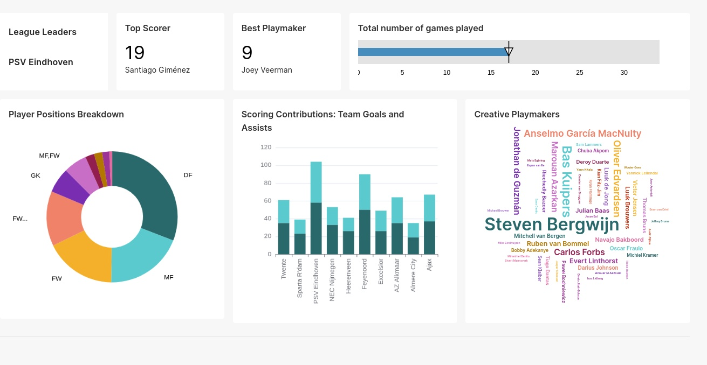
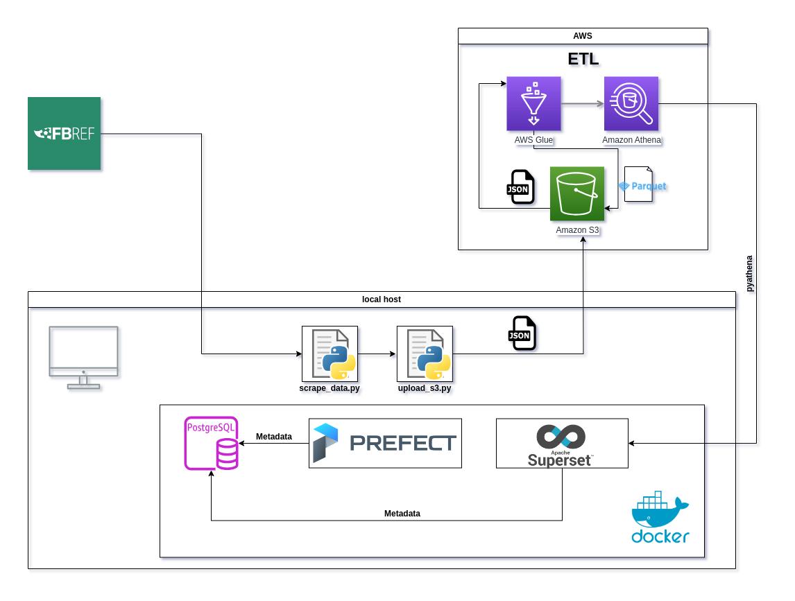

# Eredivisie-Insights

Transforming Eredivisie league data into dynamic, insightful dashboards for real-time football analytics.

## Overview

The Eredivisie Insights Project is a data pipeline and analytics platform designed to provide insights into football (soccer) matches from the Eredivisie league. The platform scrapes data from FBREF, processes it through an AWS ETL pipeline, stores it in Amazon S3, and makes it available for analysis through a PostgreSQL database, Prefect orchestration, and visualizations in Apache Superset, all containerized using Docker.

## Architecture

- Data is scraped from the FBREF website and processed locally in JSON format.
- The `scrape_data.py` script handles the data scraping and initial processing.
- The `upload_s3.py` script uploads the JSON data to Amazon S3.
- AWS Glue is utilized to run crawlers that convert the data into tabular format and create metadata.
- Amazon Athena is employed for its powerful querying capabilities against the optimized data.
- Apache Superset, running in Docker containers, provides visualization tools to interpret the processed data.
- Prefect is used for workflow orchestration.
- Metadata is of both the above mentioned services is stored in a Postgres DB

## Prerequisites

- AWS Account with access keys
- Docker and Docker Compose
- Python 3.x with pipenv

#### Things to be done

- [ ] Add Prefect deployement through AWS s3 and a Docker container
- [ ] Write a section in README.md to make the code reproduceable
- [ ] Add Docstrings to the code
- [ ] Format the code using BLACK
- [ ] Create a Makefile
